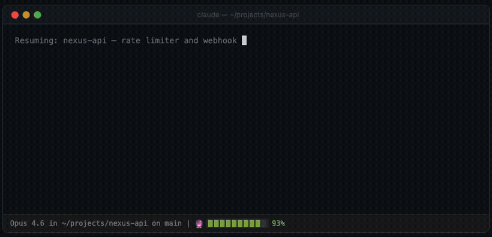

# Remembrall

[](https://github.com/cukas/remembrall/actions)

*"It glows when you've forgotten something" — like your entire context window.*

<p align="center">
  
</p>

**Context runs out. Work gets lost.** Remembrall fixes that — with session memory, parallel agents, ambient learning, and context management that makes the 200K token limit feel unlimited.

> **Zero external dependencies.** No databases, no MCP servers, no API keys. Just Claude Code's native hooks and plan mode. Install and forget — it works out of the box.

### Install

```bash
claude plugin marketplace add cukas/remembrall
claude plugin install remembrall@cukas
```

That's it. No setup needed. Remembrall monitors your context, warns you when it's running low, and seamlessly refreshes it using Claude Code's native plan mode.

```
🔮 [████░░░░░░] 30% ⚡  →  /handoff  →  plan mode  →  "Yes, clear context"  →  back to work
```

The gauge auto-configures on first session. Run `/setup-remembrall` to customize it:

```
🔮 [████████░░] 80%              green, calm
🔮 [█████░░░░░] 50% ✦            orange, sparkle
🔮 [███░░░░░░░] 28% ⚡            lightning, danger
💀 [██░░░░░░░░] 15% Obliviate!   memory wipe incoming — pulsing 🔮↔💀
🔮 [███░░░░░░░] 28% ⚡ ⏳TT       Time-Turner agent working in parallel
🔮 [████████░░] 80%    ✅TT       Time-Turner finished — /timeturner merge
🔮 [████████░░] 80%    🔥P3       Phoenix cycle 3 — session reborn
```

<p align="center">
  
</p>

---

## Features at a Glance

| Feature | Status | What it does |
|---------|--------|-------------|
| **Context Monitor** | On by default | Tracks context %, warns at thresholds, triggers handoff |
| **Auto-Resume** | On by default | Injects handoff state on session restart — seamless continuation |
| **Pensieve** | On by default | Session memory that survives compaction — files, commands, errors |
| **Avada Kedavra** | On by default | One-click instant session transfer at critical context |
| **Phoenix Rebirth** | Opt-in | Recurring AK — auto-captures and recycles indefinitely, zero clicks |
| **Time-Turner** | Opt-in | Parallel agent in git worktree at low context |
| **Marauder's Map** | On by default | Visual session overview — files, commands, burn rate |
| **Session Lineage** | On by default | Full session ancestry DAG with parent/child chains |
| **Statistics** | On by default | Ambient learning — file hotspots, patterns, recurring errors |
| **Obliviate** | On by default | Semantic memory pruning — detects and archives stale memories |
| **Context Budget** | Opt-in | Code vs conversation vs memory breakdown with warnings |
| **Patrol Integration** | Auto | Signal protocol for [Patrol](https://github.com/cukas/patrol) interop |
| **Autonomous Mode** | Opt-in | Unattended overnight runs — zero human clicks needed |

---

## What's New

### v3.0.0 — "The Session Never Dies"

**Recurring context recycling.** When context hits the urgent threshold, Phoenix captures state and triggers recycling automatically. After compaction, the cycle rearms — indefinitely, zero clicks. Same mechanism as Avada Kedavra, but recurring and automatic.

```
Cycle 1: context drains → 25% → Phoenix captures → compaction → resume → rearm
Cycle 2: context drains → 25% → Phoenix captures → compaction → resume → rearm
Cycle N: ...keeps going until phoenix_max_cycles (default 10)
```

Toggle with `/phoenix`. Config: `phoenix_mode: false`, `phoenix_max_cycles: 10`

### v3.0.0 — "The Session Never Dies"

- **The Pensieve** — Session memory that survives compaction. Tracks files, commands, errors into JSONL. Distilled and injected on resume. Config: `pensieve: true`
- **Time-Turner** — Parallel `claude -p` agent in a git worktree at 30% context. Review with `/timeturner diff`, apply with `/timeturner merge`. Opt-in: `time_turner: false`
- **Marauder's Map** — `/map` for visual session overview: context gauge, files, commands, errors, burn rate
- **Session Lineage** — `/lineage` renders a text DAG of session ancestry, branches, Time-Turner merges
- **Statistics** — `/statistics` shows file hotspots, workflow patterns, error recurrence across sessions
- **Obliviate** — `/obliviate` detects stale memories via Pensieve cross-reference, archives with confirmation
- **Context Budget** — `/budget` categorizes context into code/conversation/memory, warns on imbalance
- **Patrol Integration** — File-based signal protocol for Patrol plugin. Owl Post theme
- **Autonomous Mode** — `/autonomous` for overnight runs. Handoff + auto-compaction, no human click needed

---

## How It Works

```
┌─────────────────────────────────────────────────────────────────────┐
│                       Claude Code Session                           │
│                                                                     │
│  Status Line ──writes──> /tmp/claude-context-pct/{session_id}       │
│       │                          │                                  │
│       │                   context-monitor.sh                        │
│       │                   (UserPromptSubmit)                        │
│       │                          │                                  │
│       │              ┌─── check Patrol signals                      │
│       │              │    (handoff_trigger, context_alert)           │
│       │              │                                              │
│       │              bridge found? ──┐── no?                        │
│       │                  │           │    │                         │
│       │              use bridge   estimate from                     │
│       │                  │        transcript size                   │
│       │                  ▼           ▼                              │
│       │            >65%? ── do nothing (silent)                      │
│       │                  │                                          │
│       │           <=65%? ── journal + Obliviate + Budget (default)   │
│       │                  │  spawn: pensieve, obliviate, budget       │
│       │                  │                                          │
│       │           <=35%? ── warning + /handoff + plan mode           │
│       │                  │                                          │
│       │           <=30%? ── Time-Turner spawn (if enabled)           │
│       │                  │                                          │
│       │           <=25%? ── Phoenix auto-capture + recycle           │
│       │                  │   (if enabled, else normal AK)            │
│       │                  ▼                                          │
│       │            Plan mode: "Yes, clear context"                   │
│       │                  │                                          │
│  precompact-handoff.sh   │  ← safety net auto-handoff               │
│  + lineage-record.sh     │  ← session DAG tracking                  │
│  + pensieve-distill.sh   │  ← distill session memory                │
│       │                  │                                          │
│  session-resume.sh       │  ← inject handoff + Pensieve + Phoenix   │
│  + statistics-aggregate.sh │  ← background pattern learning         │
│  + patrol signal cleanup │  ← consume stale signals                 │
│       ▼                  │                                          │
│  Claude resumes with full context + session intelligence            │
│  Phoenix rearms — next cycle begins automatically                   │
└─────────────────────────────────────────────────────────────────────┘
```

## Nine Layers of Protection

1. **Pensieve Memory** (`pensieve-track.sh`) — Continuously tracks file operations, commands, and errors into structured JSONL. Survives compaction. Injected on every session resume.

2. **Journal Checkpoint** (`context-monitor.sh` at 65%) — Early nudge to `/handoff`. Also spawns Obliviate staleness analysis and Budget category breakdown in background.

3. **Warning Handoff** (`context-monitor.sh` at 35%) — Tells Claude to run `/handoff` and `EnterPlanMode`. Creates preemptive safety-net handoff in background.

4. **Time-Turner** (`time-turner-spawn.sh` at 30%) — Spawns a parallel agent in a git worktree with remaining tasks. Works independently while main session compacts.

5. **Phoenix Rebirth** (`context-monitor.sh` at 25%) — When enabled, auto-captures state and triggers recycling. Cycle rearms after compaction. Falls through to normal AK when disabled or max cycles reached.

6. **Avada Kedavra** (`context-monitor.sh` at 25%) — One-shot instant session transfer. Always available as fallback when Phoenix is disabled.

7. **Safety Net** (`precompact-handoff.sh`) — If all nudges are missed and auto-compaction fires, extracts task state from the transcript. Also records the session in the lineage DAG and distills Pensieve data.

8. **Auto-Resume** (`session-resume.sh`) — On session start after compaction or `/clear`, injects handoff + Pensieve memory + Phoenix chain. Spawns Statistics aggregation in background. Cleans stale Patrol signals.

9. **Stop Check** (`stop-check.sh`) — When Claude finishes a task at low context, suggests handoff or `/clear + /replay`.

---

<details>
<summary><strong>Full documentation</strong></summary>

## Installation

### Install

```bash
claude plugin marketplace add cukas/remembrall
claude plugin install remembrall@cukas
```

Run `/remembrall-status` to verify.

### Status-line bridge (auto-configured)

The bridge is auto-configured on first session — no manual setup needed. If you already have a custom `statusLine` in `~/.claude/settings.json`, Remembrall injects the bridge snippet into it. If you have no status line, Remembrall creates one that shows context % with the Remembrall gauge.

Run `/setup-remembrall` to customize the gauge appearance or reconfigure if needed.

## Configuration

Remembrall uses `~/.remembrall/config.json` for persistent settings. Run `/setup-remembrall` to configure, or edit directly:

```json
{
  "git_integration": false,
  "team_handoffs": false,
  "autonomous_mode": false,
  "retention_hours": 72,
  "easter_eggs": true,
  "threshold_journal": 65,
  "threshold_warning": 35,
  "threshold_urgent": 25,
  "debug": false,
  "pensieve": true,
  "pensieve_max_sessions": 3,
  "pensieve_inject_budget": 2000,
  "time_turner": false,
  "time_turner_model": "sonnet",
  "time_turner_max_budget_usd": 1.00,
  "threshold_timeturner": 30,
  "phoenix_mode": false,
  "phoenix_max_cycles": 10,
  "lineage": true,
  "lineage_max_entries": 50,
  "statistics": true,
  "statistics_inject": false,
  "statistics_min_sessions": 3,
  "obliviate": true,
  "obliviate_stale_sessions": 5,
  "budget_enabled": false,
  "budget_code": 50,
  "budget_conversation": 30,
  "budget_memory": 20,
  "patrol_integration": true,
  "patrol_signal_ttl": 300
}
```

### Core Settings

| Setting | Default | Description |
|---------|---------|-------------|
| `git_integration` | `false` | Save git patches of session-touched files before handoff |
| `team_handoffs` | `false` | Copy handoffs to project-local `.remembrall/handoffs/` |
| `autonomous_mode` | `false` | Skip plan mode — use `/handoff` + auto-compaction instead |
| `retention_hours` | `72` | Hours to keep handoff files before auto-cleanup |
| `max_transcript_kb` | *(auto)* | Override max transcript size in KB |
| `easter_eggs` | `true` | Harry Potter spell mappings in context nudges |
| `disabled_hooks` | `[]` | Array of hook names to disable |
| `recency_window` | `60` | Seconds to look back when matching handoffs to sessions |
| `debug` | `false` | Debug logging to `~/.remembrall/debug.log` |

### Threshold Settings

| Setting | Default | Description |
|---------|---------|-------------|
| `threshold_journal` | `65` | Context % that triggers first "run /handoff" nudge |
| `threshold_warning` | `35` | Context % that triggers "run /handoff + plan mode" |
| `threshold_urgent` | `25` | Context % that triggers AK / Phoenix |
| `threshold_timeturner` | `30` | Context % that triggers Time-Turner spawn |

### Pensieve Settings

| Setting | Default | Description |
|---------|---------|-------------|
| `pensieve` | `true` | Enable Pensieve session memory tracking |
| `pensieve_max_sessions` | `3` | Number of recent sessions to keep in Pensieve |
| `pensieve_inject_budget` | `2000` | Max characters to inject from Pensieve on resume |

### Time-Turner Settings

| Setting | Default | Description |
|---------|---------|-------------|
| `time_turner` | `false` | Enable parallel agent spawning at low context |
| `time_turner_model` | `"sonnet"` | Model for Time-Turner agents |
| `time_turner_max_budget_usd` | `1.00` | Max budget in USD per Time-Turner agent |

### Phoenix Settings

| Setting | Default | Description |
|---------|---------|-------------|
| `phoenix_mode` | `false` | Enable recurring context recycling at urgent threshold |
| `phoenix_max_cycles` | `10` | Max Phoenix cycles per chain (safety cap) |

### Session Lineage Settings

| Setting | Default | Description |
|---------|---------|-------------|
| `lineage` | `true` | Track session ancestry in a DAG |
| `lineage_max_entries` | `50` | Max sessions to keep in the lineage index |

### Statistics Settings

| Setting | Default | Description |
|---------|---------|-------------|
| `statistics` | `true` | Enable ambient learning from Pensieve data |
| `statistics_inject` | `false` | Inject statistics into session context |
| `statistics_min_sessions` | `3` | Min sessions before generating statistics |

### Obliviate Settings

| Setting | Default | Description |
|---------|---------|-------------|
| `obliviate` | `true` | Enable memory staleness analysis |
| `obliviate_stale_sessions` | `5` | Sessions without reference before marking stale |

### Budget Settings

| Setting | Default | Description |
|---------|---------|-------------|
| `budget_enabled` | `false` | Enable context budget allocation tracking |
| `budget_code` | `50` | Target % for code (tool_use/tool_result) |
| `budget_conversation` | `30` | Target % for conversation text |
| `budget_memory` | `20` | Target % for memory/system content |

### Patrol Integration Settings

| Setting | Default | Description |
|---------|---------|-------------|
| `patrol_integration` | `true` | Enable Patrol signal protocol |
| `patrol_signal_ttl` | `300` | Seconds before Patrol signals expire |

## Commands

| Command | Description |
|---------|-------------|
| `/setup-remembrall` | Manual fallback for bridge setup and config customization |
| `/remembrall-status` | Diagnostic: check context %, bridge, Pensieve, Lineage, Statistics, Budget, Patrol |
| `/remembrall-help` | List all commands, skills, and config options |
| `/autonomous` | Toggle autonomous mode on/off for overnight runs |
| `/phoenix` | Toggle Phoenix mode on/off — recurring context recycling |
| `/remembrall-uninstall` | Clean removal: bridge, data, temp files (supports `--dry-run`) |
| `/map` | Visual session overview — files, commands, errors, burn rate, Time-Turner |
| `/lineage` | Session ancestry DAG — parents, children, branches, Time-Turner merges |
| `/statistics` | Project statistics — file hotspots, workflow patterns, error recurrence |
| `/obliviate` | Review and archive stale memories |
| `/budget` | Context budget allocation breakdown |

## Skills

| Skill | Description |
|-------|-------------|
| `/handoff` | Create a structured handoff document with frontmatter, session state, Pensieve data, and git patches |
| `/replay` | Smart replay — verifies git state, checks expected files, restores patches |
| `/timeturner` | Manage Time-Turner agents — `status`, `diff`, `merge`, `cancel` |
| `/pensieve` | Browse and search Pensieve session memories |
| `/obliviate` | Guided memory pruning with user confirmation |

## Storage

```
~/.remembrall/
  config.json                                         # global settings
  calibration.json                                    # auto-calibration data
  debug.log                                           # debug log (when enabled)
  handoffs/{project-name}-{hash8}/
    handoff-{session_id}.md                           # personal handoffs
  patches/{project-name}-{hash8}/
    patch-{session_id}.diff                           # git patch snapshots
  pensieve/{project-name}-{hash8}/
    {session_id}.jsonl                                # raw session tracking
    session-{session_id}.json                         # distilled summaries
  lineage/{project-name}-{hash8}/
    index.json                                        # session DAG
  statistics/{project-name}-{hash8}/
    statistics.json                                   # aggregated patterns

/tmp/remembrall-*/                                    # ephemeral session data
  /tmp/remembrall-nudges/{session_id}                 # nudge state
  /tmp/remembrall-obliviate/{session_id}.json         # staleness analysis
  /tmp/remembrall-budget/{session_id}.json            # budget analysis
  /tmp/remembrall-signals/{session_id}/               # Patrol signal files
  /tmp/remembrall-timeturner/{session_id}/            # Time-Turner state
  /tmp/remembrall-phoenix/                            # Phoenix chain state
    chain-{session_id}                                # session → chain mapping
    {chain_id}.cycle                                  # cycle counter
    {chain_id}.lineage                                # cycle history
```

## Self-Calibrating Context Estimation

Remembrall uses a two-branch estimation strategy:

**When the bridge is active** (most accurate):

The status-line bridge writes Claude's actual context remaining % to `/tmp/claude-context-pct/{session_id}`. Auto-configured on first session. As a side effect, Remembrall derives `content_max` (how many content bytes fit before context runs out) from the equation: `content_max = content_bytes / (used_pct / 100)`. This auto-calibrates per user, per model. Calibration samples are stored once context usage reaches 20%.

**When the bridge is unavailable** (fallback):

1. **Structural JSONL parser** — Parses transcript content bytes and compares against the bridge-derived `content_max` (if calibrated) or model-specific defaults.

2. **File-size fallback** — Last resort when structural parsing fails. Uses raw transcript size against calibrated or model-specific maximums.

Calibration data is stored at `~/.remembrall/calibration.json` and persists across sessions.

## Time-Turner Integration

All features work seamlessly with Time-Turner parallel agents:

- **Pensieve**: TT sessions contribute to file hotspots, workflow patterns, and error recurrence
- **Session Lineage**: TT branches appear in the DAG with `type: "time-turner"`. Merged agents get `status: "merged"`
- **Obliviate**: Runs in main session only. Considers TT session activity when evaluating staleness
- **Context Budget**: Each session (main or TT) tracks its own budget independently
- **Patrol Integration**: Signals route to main session only. TT agents continue independently

### Cost Reduction

These features make Time-Turner cheaper:

1. **Obliviate** prunes stale memories BEFORE TT agents spawn — leaner context, fewer wasted tokens
2. **Context Budget** keeps the main session within allocation — delays hitting the TT threshold
3. **Statistics** feed targeted tasks to TT agents instead of "continue remaining work"
4. **Session Lineage** tracks which TT branches were productive vs wasteful — data for smarter spawning decisions
5. **Patrol** can suppress TT spawn via `context_alert` signal with `skip_timeturner: true`

## Patrol Integration Protocol

Remembrall and [Patrol](https://github.com/cukas/patrol) communicate via file-based signals in `/tmp/remembrall-signals/{session_id}/`. Patrol is fully optional.

**Signal types:**

| Signal | Direction | Description |
|--------|-----------|-------------|
| `handoff_trigger` | Patrol → Remembrall | Request immediate handoff |
| `context_alert` | Patrol → Remembrall | Advisory message, optional `skip_timeturner` flag |

Patrol writes `{signal_type}.json` → Remembrall reads payload + deletes file. Signals expire after `patrol_signal_ttl` seconds (default 300).

See `docs/patrol-integration.md` for the full protocol spec.

## Git Integration

When enabled, Remembrall captures git patches of your session's uncommitted changes before handoff. Only files touched by Claude during the session are included.

- Patches stored at: `~/.remembrall/patches/{project-hash}/patch-{session}.diff`
- Your repo stays clean — no WIP commits, no stashes
- On `/replay`, patches are verified and offered for restore
- If HEAD moved since handoff, you're warned before applying

## Team Handoffs

When enabled, handoffs are also saved in your project directory at `.remembrall/handoffs/`. Another team member's Claude session can pick up where yours left off.

## Requirements

- Claude Code with plugin support
- `jq` — required; hooks exit gracefully if missing but will not function
- `md5` (macOS) or `md5sum` (Linux/WSL) — required for project hashing
- `git` — optional; only needed when `git_integration` is enabled

### Platform Support

| Platform | Status |
|----------|--------|
| macOS | Fully supported (`md5`, `stat -f`) |
| Linux | Fully supported (`md5sum`, `stat -c`) |
| WSL | Fully supported (uses Linux userspace) |
| Windows (native) | Not supported — use WSL |

## Troubleshooting

**`jq` not installed** — Hooks exit silently without `jq`. Run `jq --version` to check. Install via `brew install jq` (macOS) or `sudo apt-get install jq` (Linux).

**`md5`/`md5sum` not found** — Handoff directory computation fails silently. Install `coreutils` (`brew install coreutils` on macOS, pre-installed on Linux).

**Bridge not injecting** — Check if the bridge snippet is present: `grep -q "claude-context-pct" ~/.claude/settings.json && echo OK || echo MISSING`. If missing, restart your session or run `/setup-remembrall`.

**Handoff not consumed on resume** — Run `/remembrall-status` and look for `.claimed-*` or `.consumed` files.

**Stale calibration after model switch** — Delete `~/.remembrall/calibration.json`.

**Hooks don't seem to be running** — Ensure scripts are executable: `chmod +x hooks/*.sh scripts/*.sh`. Enable debug logging and check `~/.remembrall/debug.log`.

**Time-Turner agent not spawning** — Ensure `time_turner: true` is set in config. Check that `claude` CLI is on PATH and git worktrees are supported in your repo.

**Phoenix not cycling** — Ensure `phoenix_mode: true` in config. Check `/phoenix status` for chain info. Phoenix fires at the same threshold as AK (`threshold_urgent`, default 25%).

**Pensieve not injecting** — Check `pensieve: true` in config. Run `/remembrall-status` to see Pensieve data directory and session count.

**Statistics not generating** — Need at least `statistics_min_sessions` (default 3) Pensieve sessions. Statistics aggregate on SessionStart — start a new session to trigger.

**Obliviate shows no stale memories** — Memories must be older than `obliviate_stale_sessions * 2` hours (default 10h). Recent Pensieve references reduce staleness.

## FAQ

**Does Remembrall bloat my context?** No. Nudges are short one-line messages. Pensieve injection is capped at `pensieve_inject_budget` characters (default 2000). There is no accumulated memory that grows over time.

**Is the Time-Turner safe?** Yes. It's opt-in, budget-capped, worktree-isolated, and never auto-merges. You review changes via `/timeturner diff` before merging.

**What's the difference between Phoenix and AK?** Avada Kedavra is a one-shot emergency session transfer. Phoenix wraps AK in a recurring cycle — it captures state, triggers recycling, and rearms automatically after compaction. Same threshold, but Phoenix keeps going indefinitely (up to `phoenix_max_cycles`).

**What does Obliviate actually delete?** Nothing — it archives. Stale memories are moved to `.archive/` in the memory directory. You can restore them manually.

**Can I use Remembrall without Patrol?** Yes. Patrol integration is purely additive. With Patrol not installed, the signal check returns empty and has zero overhead.

**Are there any easter eggs?** Maybe. Try speaking to Claude in the language of wizards when the Remembrall starts glowing. 🔮

## Privacy

Remembrall is fully local. No network requests, no analytics, no telemetry. All data stays on your machine:

- Handoffs: `~/.remembrall/handoffs/`
- Patches: `~/.remembrall/patches/`
- Pensieve: `~/.remembrall/pensieve/`
- Lineage: `~/.remembrall/lineage/`
- Statistics: `~/.remembrall/statistics/`
- Temp files: `/tmp/remembrall-*/` (cleared on reboot)

## License

MIT

</details>
